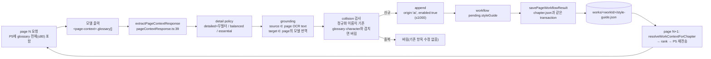
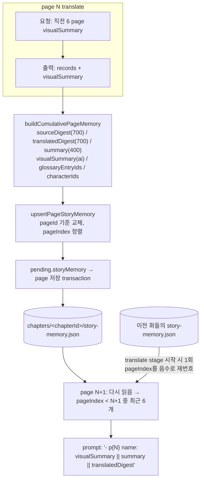

# Translation LLM Request / Context Analysis

## Project Tracking

> 이 블록은 관련 milestone 링크만 담는다. 계획·상태(CURRENT/IDEAS/REJECTED)의 source of truth는 [docs/milestones](../milestones/README.md)다. 아래 분석 본문은 작성 시점의 근거 자료다.

Related milestones:
- [M1 Linux Port](../milestones/M1_LINUX_PORT/README.md) — 최소 Linux translation contract, M1 blocker 판단
- [M2 Test Set / Benchmark](../milestones/M2_TEST_SET/README.md) — translation 계측 항목
- [M3 Pipelining](../milestones/M3_PIPELINING/README.md) — memory 순차 의존과 page 병렬 요청
- [M4 Optimization](../milestones/M4_OPTIMIZATION/README.md) — Translation 최적화 후보의 측정 근거
- [M5 Features](../milestones/M5_FEATURES/README.md) — chapter 간 story memory 순서 의존

Tracking: [M1 CURRENT](../milestones/M1_LINUX_PORT/CURRENT.md) · [M2 CURRENT](../milestones/M2_TEST_SET/CURRENT.md) · [M2 IDEAS](../milestones/M2_TEST_SET/IDEAS.md) · [M3 IDEAS](../milestones/M3_PIPELINING/IDEAS.md) · [M4 IDEAS](../milestones/M4_OPTIMIZATION/IDEAS.md) · [M5 IDEAS](../milestones/M5_FEATURES/IDEAS.md)

## 0. Scope and Evidence Rules

이 문서는 CarrotMangaTranslator staged workflow의 translate stage가 **LLM에게 실제로 무엇을 보내는지**를 production code path와 저장된 실제 요청 artifact로 끝까지 추적한 결과다. RoverCMT Milestone 1(Linux 포팅)의 translation contract와, 이후 translation 병목 최적화의 기준 자료로 쓴다.

이번 작업에서 하지 않은 것:

- 구현, 리팩터링, runtime/endpoint 호출, benchmark
- Carrot source, library, 기존 분석 문서, renderer 관련 파일 수정

표기 규칙(기존 분석 문서와 동일):

- **[FACT]** source 또는 local artifact에서 직접 확인했다.
- **[INFERENCE]** 확인된 사실에서 도출했지만 실행으로 검증하지 않았다.
- **[UNKNOWN]** 이번 조사로 확인할 수 없었다. 추정치를 만들지 않았다.
- **[PROPOSAL]** 제안이다. 사용자 결정이 필요하다.

선행 문서와 인용 약어:

| 약어 | 문서 |
|---|---|
| TR | `TRANSLATION_PIPELINE_MIGRATION_ANALYSIS.md` |
| CORE | `CORE_DATA_MODEL_PIPELINE_CONTRACT_ANALYSIS.md` |
| OCR | `OCR_RUNTIME_MIGRATION_ANALYSIS.md` |
| DET | `DETECTION_PIPELINE_MIGRATION_ANALYSIS.md` |

### 0.1 Evidence base

- **Source**: 아래 §2의 call path 파일 전부를 이번에 직접 읽었다. 기존 문서와 다른 점은 §21에 모았다.
- **Artifact**: 두 data root(repo root `library/`, 설치 앱 `%LOCALAPPDATA%\Programs\carrot-manga-translator\data\library`)의 `runs/*/pages/*/attempt-*/result.json` **218건**(repo 99, 설치 앱 119), 5 chapters, 9 runs. `result.json`은 `prompt`(user prompt 전문), `systemPrompt`, `requestSummary`(hint, previous block, image variant, option), `outputText`, `rawResponse`(`usage`, llama.cpp `timings`)를 담는다.
- **Memory 파일**: `style-guide.json` 5개, `story-memory.json` 5개.
- 측정은 읽기 전용 scratch script로 했다. 원문, 번역문, glossary 용어, 캐릭터 이름, endpoint 주소, 사용자 경로, API key는 이 문서에 옮기지 않았다. 두 data root 모두 `apiKeyConfigured=false`, custom header 없음이다.
- 모든 수치는 조사 시점 snapshot이다. 사용자가 Carrot을 계속 쓰고 있으므로 이후 값은 달라질 수 있다.

## 1. Executive Summary

1. **[FACT] 요청 1건 = page 1장.** staged translate는 page마다 `POST {apiBaseUrl}/chat/completions`를 1회(실패 시 최대 5회) 보낸다. message는 `system`(1,815자, 218건 모두 동일)과 `user`(`image_url` 1개 + 이미지 설명 1줄 + prompt text 1개)뿐이다. JSON schema/`response_format`은 없다.
2. **[FACT] 원본 page 이미지가 매 요청에 원본 bytes 그대로 base64로 들어간다.** client 측 resize/재인코딩은 없다(webp만 PNG 변환). 실측 파일 크기 median 1.61 MB, max 6.79 MB(base64 median 약 2.15 MB). 요청 body의 대부분은 이미지다. user prompt text는 median 25.0k자다.
3. **[FACT] prompt text의 약 79%는 매 요청 동일한 정적 지시문이다.** (system 포함 median 21.3k / 26.8k자) 페이지마다 바뀌는 부분은 work context(median 2.1k자), Previous pass blocks(1.4k), HayaiOCR candidate(2.1k)뿐이다. 가장 큰 단일 section은 대부분 SFX 규칙인 `Rendering hints`(6,375자)다.
4. **[FACT] 같은 block 정보가 한 요청에 두 번 들어간다.** 실제 218건 1,255 block에서 `Previous pass blocks`의 `jp`는 candidate `ocrText`와 1,188/1,188 동일했다. bbox 차이는 최대 1(0–1000 좌표)이었다. 이전 번역 `ko`는 0/1,255건이었다. translate 대상 선정이 "번역이 빈 block"이기 때문이다. 관측 범위에서 이 section은 정보를 더하지 않는다.
5. **[FACT] 모델 출력 시간이 translation wall time을 지배한다.** 218건 합계 기준 생성(`predicted_ms`) 76%, prefill(`prompt_ms`) 16%, 나머지(client 준비, 전송, 대기) 약 8%다. page당 median은 wall 8.3 s, 생성 5.9 s, prefill 1.34 s다. completion tokens는 block 수에 거의 선형으로 늘었다(2 blocks 310 → 10 blocks 1,094 → 20 blocks 2,034, median).
6. **[FACT] 출력의 대부분은 최종 저장되지 않는다.** output 문자 중 page-context trailer가 median 29%다. record 1개는 median 160자인데 그중 `ko`는 median 9자다. staged merge(`mergeWorkflowTranslations`)는 `translatedText`(+ font role 3필드)만 저장한다. 모델이 다시 쓴 `jp`, 좌표, `direction`, `angle`, `fontSize`는 최종 page state에 저장되지 않는다. 일부는 parse/validation 단계에서만 쓰인다.
7. **[FACT] 모델은 매 페이지 캐릭터/용어를 다시 "발견"한다.** trailer의 character 후보 355개 중 295개(83%), glossary 후보 240개 중 167개(70%)가 **같은 요청에 이미 제공된** 항목의 반복이었다. prompt는 반복을 금지하는데도 그렇다. 반복분은 이름 collision 검사로 버려진다. 저장된 항목은 전체 49 glossary / 33 characters이고 모두 `origin:"ai"`다.
8. **[FACT] glossary/character memory는 append-only이고 기존 항목을 고칠 경로가 없다.** grounding은 "source가 이 page OCR에 있고, target이 이 page의 **모델 자신의 번역**에 있다"는 조건뿐이다. 첫 page의 오역이 work 전체에 "glossary는 story memory보다 강하다"는 지시와 함께 고정될 수 있다.
9. **[FACT] OCR(Hayai)은 prompt 문구상 "reading hint"이지만 구조상 필수 입력이다.** `sourceText`가 빈 block은 번역 대상에서 빠진다. 같은 page에 빈 원문 block이 하나라도 있으면 stage가 예외를 던진다. 실제로 모델 출력 `jp`의 90%(1,129/1,254)가 OCR text와 정규화 후 완전히 같았다. 현재 prompt contract 그대로는 OCR 없이 성립하지 않는다(§11, §14).
10. **[FACT] 원격 llama.cpp prompt cache는 page 간에 거의 효과가 없다.** `cached_tokens`는 204/218건이 0이었다. 12건은 정확히 383 tokens(= chat template + system prompt prefix)였고, 2건만 같은 page 재시도로 전체 hit였다. 이미지가 system 직후 user content 맨 앞에 있어 공통 prefix가 거기서 끊긴다. 기존 TR §9.2의 "cached_tokens가 높다"는 서술은 틀렸다(§21).
11. **[FACT] context budget pruning은 실제로 한 번도 동작하지 않았다.** 218/218건이 `omittedParts=[]`였고 output headroom은 최소 58k tokens였다. pruning이 동작하더라도 요약이 아니라 story → glossary → characters 순으로 section 전체를 통째로 버린다. prompt 크기를 실제로 제한하는 것은 고정 상한(glossary 80, characters 40, story 6 pages, block 80)이다.

**M1 blocker: 새 blocker는 없다**(§18). Rover는 현재 prompt builder(CJS, Electron 의존 없음)를 그대로 옮기고, 원본 이미지 bytes와 work memory 파일 2개를 같은 의미로 다루면 현재 동작을 재현할 수 있다. 원격 server 측 vision 설정(이미지 token 수)은 **[UNKNOWN]**이다. 이 값은 parity 검증의 변수로 기록해야 한다.

## 2. Actual Production Call Path

**[FACT]** 기준 설정: 두 data root `settings.json` 모두 `modelProvider="openai-api"`, `ocr.pipeline="hayai"`, `translation.sourceLanguage="ja"`, `targetLanguage="ko"`다. `ui.pageWorkflowDefault`는 `cumulative:true`, `cumulativeDetail:"detailed"`, `experimentalParallelAcceleration:false`다. 218건 artifact 전부 `promptMode="overlay_bbox_lines_multiview"`, `strictRefineMode=true`, `keepBlocksMode=true`, `ocrPipeline="hayai"`, image variant 1개(`original`)였다.

```text
executeWorkflowStage(stage="translate")                pageWorkflow/pageWorkflowRuntime.ts:162
 └ prepareWorkflowStage (stage 시작 시 1회)             pageWorkflowRuntime.ts:185
     context.previousStoryPages = resolvePreviousChapterStoryPages(chapter)   previousChapterContext.ts:29
 └ translateWorkflowPage(context, chapter, page)        pageWorkflow/pageWorkflowTranslation.ts:8
    ├ assertWorkflowSource                              :107  빈 sourceText block이 있으면 throw
    ├ blocks = workflowTargetBlocks(page,"translate")   shared/pageWorkflowPolicy.ts:65
    │     (sourceText 있음 && translatedText 빔(overwrite 아니면))
    ├ workContext = resolveWorkContextForChapter(id)    libraryStore/workContextFiles.ts:265
    │     style-guide.json + story-memory.json 을 디스크에서 매 page 새로 읽음
    ├ preparedOcrHints = buildKeepBlocksOcrResult(input, blocks.map(sourceText))
    │                                                   pipeline/keepBlocksResult.ts:43
    └ runWholePagePipeline({pages:[input], blockMode:"keep", collectPageContext: plan.cumulative,
         cumulativeContextDetail, workContext:{…, recentPageCount:6, previousStoryPages}})
                                                        wholePagePipeline.ts:77
       └ prepareWholePageRun → preparedOcrHints 사용(OCR 재실행 없음)          :518
       └ completeWholePageRun → preparePagesWithinEndpointSession            :441
          ├ startWholePageEndpoint → startAnalysisEndpointSession → startModelEndpointSession
          │     openai-api: createOpenAICompatibleApiEndpoint (객체만 생성)   openaiApiEndpoint.ts:11
          ├ prepareTranslatedPages → prepareModelPage → preparePageWithRetries
          │                                             pipeline/translatePageWithRetries.ts:71
          │   for attempt in 1..maxAttempts(=MANGA_TRANSLATOR_PAGE_RETRIES, 기본 5):
          │     buildRequestPageOptions                pipeline/pageResultBuilder.ts:91
          │       ├ buildPageOptions(imagePath=page.imagePath(원본), imageWidth/Height)  options.ts:30
          │       ├ applyOcrHintPageOptions → ocrBboxResult/ocrBboxHints
          │       ├ applyWorkContextPageOptions
          │       │   ├ collectGlossaryOmissionTerms
          │       │   ├ buildPromptWorkContextForPage (rank + 최근 6p)  pipeline/workContextPrompt.ts:14
          │       │   └ prunePromptWorkContextForBudget({ctx,maxTokens})  shared/workContextBudget.ts:82
          │       └ applyStrictRefineOptions → previousBlocksForPrompt, temperature≤0.1…  :578
          │     applyEnhancedRetryVariant (직전 실패가 empty-overlay-items일 때만)
          │     preparePageTranslationAttempt → runtime.requestTranslation   translationRuntimePort.ts:170
          │       (openai-api이면 prepareExternalImage = prepareExternalImageFile)
          │       └ requestTranslation                 runtime/transport/translation-request.cjs:73
          │          ├ collectOcrBboxHints → createPromptOptions   transport/translation-ocr-policy.cjs:22
          │          ├ shouldSkipModelRequest / group-review / fixed-block 판정(모두 미해당 §2.1)
          │          ├ prepareTranslationRequest       :246
          │          │   ├ prepareImageVariants        runtime/assets/image-variants.cjs:19
          │          │   │   └ fileToModelAsset → data:<mime>;base64,…  assets/image-source-assets.cjs:200
          │          │   ├ getOverlayPrompt → buildOverlayPrompt   prompts/overlay-prompt.cjs:108
          │          │   ├ buildSystemPrompt                        prompts/system-prompt.cjs:13
          │          │   └ buildChatRequestBody(buildMessages(…))   simple-page-request-builders.cjs:83, :273
          │          └ requestChatTranslation → runWithApiKeyRetry → sendChatCompletion
          │                fetch(`${baseUrl}/chat/completions`, POST, non-streaming)  transport/chat-completion.cjs:58
          │     saveArtifacts → runs/<run>/pages/<page>/attempt-N/result.json 등
          │     preparePageResult → parsePageResponse(trailer 분리, record parse)  pageResponseParser.ts:110
          │   persistPreparedPageContext (preview: in-memory rolling context만 갱신)  wholePagePipeline.ts:834
          └ finally: disposeEndpointSession (openai-api: Ollama면 unload, 아니면 no-op)
       └ finalizeTranslatedPages → persistPageContextAfterSuccess(실제 repository)  :948
            workflow에서는 repository = pending 버퍼                 pageWorkflowRuntime.ts:32
 └ mergeWorkflowTranslations (block.id 기준, 비어 있지 않은 번역만)    pageWorkflowTranslation.ts:76
executeWorkflowPage → runtime.save → savePageWorkflowResult(chapterId, before, after, pending)
                                                        libraryStore/pageWorkflowMutations.ts:19
   한 library transaction 안에서 story-memory.json, style-guide.json, chapter.json, work.json 저장
```

### 2.1 비사용 분기 확인

| 분기 | 218건에서 | 근거 |
|---|---|---|
| fixed-block translation(`requestFixedBlockTranslation`) | 미사용 | **[FACT]** `isHayaiLockedRegionMode`는 모든 hint에 `geometryLocked===true`를 요구한다(`semantic-ocr/fixed-block-translation.cjs:68`). artifact의 정규화 hint는 `geometryLocked:false`였다 |
| group-only review | 미사용 | **[FACT]** `isGroupOnlyReviewEligible`은 `modelProvider==="gemma"`를 요구한다 |
| enhanced image variant | 0/218 | **[FACT]** 218건 모두 variant 1개. 재시도 page 2건도 직전 실패가 `empty-overlay-items`가 아니었다 |
| no-text skip | 미사용 | **[FACT]** `collectPageContext=true`이면 skip하지 않는다(`translation-ocr-policy.cjs:67`) |
| image redaction copy | 미사용 | **[FACT]** redaction context가 없으면 원본 path를 그대로 반환한다(`imageRedactionContext.ts:153`). redaction이 켜져 있는데 review가 없으면 예외를 던진다 |
| `ocrGeometryOnlyMode` | 미사용 | **[FACT]** keep-block hint는 `textEvidenceCount = hints.length`다. 모든 hint가 `ocrText`를 가졌다 |

## 3. Exact Request Anatomy

### 3.1 HTTP 계층 [FACT]

| 항목 | 값 | 근거 |
|---|---|---|
| method/URL | `POST {settings.api.baseUrl}/chat/completions`. baseUrl은 `/v1`로 끝나는 LAN 주소이고 port는 11434가 아니다 | `chat-completion.cjs:58`, settings 확인(주소 비공개) |
| header | `Content-Type: application/json`. API key가 설정됐을 때만 `Authorization`을 붙인다(현재 미설정). custom header 없음 | `buildChatRequestHeaders`, artifact `apiKeyConfigured=false` |
| streaming | 없음(단일 JSON 응답) | `readChatCompletionResult` |
| deadline | 30분(`MODEL_HTTP_REQUEST_DEADLINE_MS`) | `transport/network-budgets.cjs:4` |
| retry | page 단위 최대 5회. 매 attempt마다 같은 요청을 다시 만든다 | `endpointSession.ts:82` |

### 3.2 Body [FACT]

`buildChatRequestBodyWithModelResolver`의 `openai-api` 분기(`simple-page-request-builders.cjs:273`):

```jsonc
{
  "model": "<settings.api.model>",            // 실제: gemma-4-26B-A4B … Q6_K.gguf (TR §2.1)
  "max_tokens": 8192,                          // settings.translation.maxTokens (한 run은 32768)
  "messages": [ /* §3.3 */ ],
  "temperature": 0.2,                          // resolveConfiguredApiTemperature: env > api.temperature
  "top_p": 0.95,                               // api.topP
  // "top_k": 생략(api.topK=null), "reasoning_effort": 생략(null)
  "chat_template_kwargs": { "enable_thinking": false }   // api.extraBodyJson 병합
}
```

- `applyStrictRefineOptions`의 `temperature≤0.1, topP≤0.85, topK≤32` 제한은 `pageOptions.temperature/topP/topK`에만 적용된다. artifact에서도 0.1/0.85/32로 기록됐다. `openai-api` body는 `apiTemperature/apiTopP/apiTopK`를 쓰므로 **이 제한은 전송되지 않는다**. 기존 TR §3.3과 §14-5의 UNKNOWN은 이것으로 해소됐다.
- `response_format`, `seed`, `stop`, `cache_prompt`, `n_probs`는 없다.

### 3.3 Messages 구조 [FACT]

`buildMessages` (`simple-page-request-builders.cjs:83`):

```text
messages[0]  role=system
  content[0]  type=text   buildSystemPrompt(options)                  1,815자 (218/218 동일)
messages[1]  role=user
  content[0]  type=image_url  image_url.url = "data:image/png;base64,…"  원본 page 파일 bytes
  content[1]  type=text   "Image 1: the original full manga page. Use it as the geometry authority.
                           It is {W}x{H} px. Original page size is {W}x{H} px."
  content[2]  type=text   buildOverlayPrompt(…)                       22,961–27,552자 (median 25,022)
```

순서는 **system → 이미지 → 이미지 설명 → 긴 지시문**이다. 공통 prefix는 system 뒤에서 끊긴다(§12.3).

### 3.4 User prompt section 순서와 출처 [FACT]

`buildOverlayPrompt`(`prompts/overlay-prompt.cjs:108`)는 `OVERLAY_PROMPT_SECTIONS`(`simple-page-prompts.cjs:24`)를 복사한 뒤 section을 교체하고 삽입한다. 각 section은 `# Title` + 줄들이고 section 사이는 빈 줄 하나다. 218건의 실제 순서와 크기(문자 수, section 제목과 구분자 포함)는 다음과 같다. 이 문서에서 prompt section은 문서 절 번호(§)와 구분하려고 `P1`–`P11`로 부른다.

| P | Section | 생성 함수 | 변동 요인 | 크기 min / median / max |
|---|---|---|---|---|
| 1 | Task | `task-sections.cjs` `buildTaskSection` | variant 수, strict/keep flag | 1,016 / 1,016 / 1,016 |
| 2 | Output | 정적 + `SMALL_GEMMA_DUPLICATE_OUTPUT_LINES` 무조건 삽입 + page-context 예외 문구 | collectPageContext | 3,422 고정 |
| 3 | Coordinate calibration | `coordinates.cjs` | page W×H | 436 / 437 / 437 |
| 4 | Strict refinement mode | `buildStrictRefineSection`(keep 분기) | flag | 1,658 고정 |
| 5 | Work glossary and story memory | `work-context.cjs` | glossary, characters, story, rules | 340 / 2,133 / 2,564 |
| 6 | Previous pass blocks | `previous-pass.cjs` | 대상 block | 971 / 1,449 / 2,860 |
| 7 | Locked ordinary-text regions (HayaiOCR) | `ocr-bbox-section.cjs` `buildHayaiRegionSectionLines` | 대상 block | 1,696 / 2,130 / 3,369 |
| 8 | Geometry | 정적 | — | 2,927 고정 |
| 9 | Segmentation | 정적 + `SMALL_GEMMA_DUPLICATE_SEGMENTATION_LINES` | — | 2,064 고정 |
| 10 | Rendering hints | 정적 | — | 6,375 고정 |
| 11 | Page context trailer | `page-context.cjs` | collectPageContext, detail | 1,592 고정 |

- `Locked ordinary-text regions (HayaiOCR)` 형식은 `isHayaiOcrPipeline(options)`, 즉 **settings `ocr.pipeline="hayai"`** 일 때 선택된다(`ocr-bbox-section.cjs:56`). keep mode와는 무관하다. pipeline 값이 다르면 같은 hint가 `OCR bbox candidates` section(규칙이 다름)으로 출력된다.
- Font matching intent section은 `autoFontMatching=false`라 없다. omission rule 줄은 218건 모두 0개였다.
- **언어**: 정적 문구는 일본어→한국어를 전제로 쓰였다. `localizePromptTextForProfile`가 다른 언어쌍일 때만 문구를 바꾼다.

### 3.5 Section별 실제 내용 요소

| 요소 | 위치 | 형식(실제 줄 모양, 텍스트 마스킹) |
|---|---|---|
| system 규칙 | system | OCR/번역 engine 역할, geometry 우선, 말풍선 병합 금지, 한국어 가로쓰기, SFX 3줄, strict/keep 4줄 |
| 현재 page 이미지 | user content[0] | 원본 bytes data URL |
| page 크기 | content[1], P3 | `It is 1280x1791 px.` / `The original page is 1280x1791 px.` |
| OCR text(sourceText) | P7 candidate | `candidate 1: label:block x1:729 y1:94 x2:913 y2:302 score:1 ocrText:"<TEXT>"` |
| 같은 OCR text 재등장 | P6 previous | `previous 1: candidateId:1 bbox:[729,94,914,301] role:ordinary confidence:0.58 jp:"<TEXT>"` |
| block identity | P6, P7 | 요청 내 index id `1..N`만 쓴다. 영속 `block.id`는 prompt에 없다(`previousId`는 requestSummary에만 저장) |
| bbox | P6, P7 | 0–1000 정규화 좌표, 두 번 |
| detector confidence | P6 | `confidence:0.58`(block.confidence). P7은 `score:1` 고정 |
| 이전 번역 | P6 `ko` | 관측 0/1,255(§6.1, §1-4) |
| glossary | P5 | `- [category] <SOURCE> => <TARGET>[ aliases=…][ note=…]`, enabled이고 target이 있는 항목 최대 80개, page 관련도 순 |
| characters | P5 | `- <NAME>: sourceNames=<…> targetName=<…> speechStyle=<style>`, 최대 40 |
| story memory | P5 | `- p{N} <pageName>: <visualSummary>`, 직전 6 page(이전 화 포함, 이전 화는 `p` 번호 없이 `<chapterTitle> · <pageName>`) |
| translation rules | P5 마지막 줄 | `Rules: honorifics=adapt, sfxMode=translate, defaultTone=natural_korean.`(5개 work 모두 기본값) |
| work/chapter metadata | — | **보내지 않는다.** `workTitle`은 읽지만 prompt에 쓰지 않는다. chapter 제목은 이전 화 story line label에만 나온다 |
| output schema | P2, P11 | plain-text record 13 key + `<page-context>` JSON trailer(§3.6) |

### 3.6 요구되는 출력 형식 [FACT]

```text
id: <integer>            ← candidate id 재사용
type: nonsolid
textRole: <ordinary|sound>
x1: … y1: … x2: … y2:    ← candidate 좌표 그대로
direction: <horizontal|vertical>
angle: <integer>
fontSize: <integer>
confidence: <0.00-1.00>
jp: <visible Japanese source text>
ko: <concise Korean translation>
                          ← record 사이 빈 줄
<page-context>
{"visualSummary":"…","glossary":[{source,target,category,aliases,note}],"characters":[{displayName,sourceNames,targetName,aliases,speechStyle,customSpeechStyle,note}]}
</page-context>
```

218/218건 출력에 trailer가 있었고 `finish_reason`은 모두 `stop`이었다.

## 4. Reconstructed Example Request

**[FACT]** 실제 요청 1건을 비밀값과 사용자 텍스트를 제거해 재구성했다. 대상은 repo data root chapter `592a103c`, run `1336145f`, page `050e268b`, attempt-1이다. 대상 block 2개, glossary 16, characters 7, story 6 pages가 들어갔다.

```jsonc
POST <LAN_ENDPOINT>/v1/chat/completions
Content-Type: application/json
// Authorization 헤더 없음 (apiKeyConfigured=false)

{
  "model": "<gemma-4-26B-A4B … Q6_K.gguf>",
  "max_tokens": 8192,
  "temperature": 0.2,
  "top_p": 0.95,
  "chat_template_kwargs": { "enable_thinking": false },
  "messages": [
    { "role": "system", "content": [ { "type": "text", "text":
      "You are an OCR and manga-translation engine.\n\nReturn only the machine-readable record format requested by the user prompt.\n\nGeometry accuracy comes before Korean text fit: …\n\n… (SFX 규칙 3단락) …\n\nStrict refinement pass: previous jp/ko blocks and story memory are weak review hints only, not source text. …\n\nFixed-blocks pass: the OCR candidates are user-defined block slots. Output at most one record per candidate id, never merge candidates, and never invent a new id.\n\nIf a previous block contains Latin garbage, romanized ruby, stray katakana, or wording not supported by the visible glyphs, discard that wording and re-read Image 1."
      /* 1,815자 */ } ] },
    { "role": "user", "content": [
      { "type": "image_url", "image_url": { "url": "data:image/png;base64,<원본 PNG 1,434,650 bytes → base64 약 1.91 MB>" } },
      { "type": "text", "text": "Image 1: the original full manga page. Use it as the geometry authority. It is 1280x1791 px. Original page size is 1280x1791 px." },
      { "type": "text", "text": "<user prompt 24,871자, 아래>" }
    ] }
  ]
}
```

User prompt 전문 구조(정적 section은 첫 줄과 크기만, 동적 section은 줄 단위로 표시):

```text
# Task                                                    [1,016자, 정적]
You are given one full-page Japanese manga image.
Image 1 is the coordinate-authority full page.
Detect every visible Japanese text group and translate it into concise Korean.
This is a fixed-blocks refinement. The OCR candidates are user-defined block regions; …
… (6줄 더)

# Output                                                  [3,422자, 정적]
Return translation records as plain text only. … the only JSON exception is the required <page-context> trailer …
Use exactly these keys, one per line: id, type, textRole, x1, y1, x2, y2, direction, angle, fontSize, confidence, jp, ko.
… Record template: …

# Coordinate calibration                                  [437자, page 크기만 변동]
The original page is 1280x1791 px.
Return x1, y1, x2, y2 as normalized 0..1000 corner coordinates over Image 1, …

# Strict refinement mode                                  [1,658자, 정적]
Fixed-blocks refinement: every OCR candidate below is a user-defined block slot, …
When a candidate includes an ocrText hint, treat it as the primary reading evidence: verify it against Image 1 and translate that text.
Story memory can contain earlier machine-translation mistakes. …

# Work glossary and story memory                          [2,492자, work/chapter 상태]
Do not output these notes as records.
Glossary and character entries are stronger than story memory. …
Use these glossary entries for consistency. If the source text matches an entry or alias, prefer the target Korean exactly unless Image 1 clearly proves a different meaning.
When a glossary term is written as kanji with furigana/ruby, …
- [category] <SOURCE> => <TARGET> …                       × 16
Character/name memory. Keep names and speech style consistent when translating dialogue.
- <NAME>: sourceNames=<…> targetName=<…> speechStyle=casual|neutral   × 7
Recent story context from previous pages. Use it only to resolve pronouns, …
- p39 <pageName>: <visualSummary 52–98자>                × 6 (p39–p44)
Rules: honorifics=adapt, sfxMode=translate, defaultTone=natural_korean.

# Previous pass blocks                                    [1,088자, page]
These are weak review hints from the previous Korean overlay pass. …
Previous jp/sourceText may be an OCR-derived hallucination too. …
Each previous block lists the candidateId of its own user-defined slot. …
previous 1: candidateId:1 bbox:[729,94,914,301] role:ordinary confidence:0.58 jp:"<OCR TEXT 1>"
previous 2: candidateId:2 bbox:[163,622,195,760] role:ordinary confidence:0.93 jp:"<OCR TEXT 2>"

# Locked ordinary-text regions (HayaiOCR)                 [1,802자, page]
The app has already separated and finalized every ordinary dialogue, … region. …
Hayai OCR text is a reading hint, not geometry authority. Re-read Image 1 to correct recognition errors, …
Do not add records with new ids. Do not search outside the supplied candidates …
Candidate ids to translate independently: 1, 2.
The candidate coordinates below are already converted into the exact output coordinate frame.

candidate 1: label:block x1:729 y1:94 x2:913 y2:302 score:1 ocrText:"<OCR TEXT 1>"
candidate 2: label:block x1:163 y1:622 x2:195 y2:760 score:1 ocrText:"<OCR TEXT 2>"

# Geometry                                                [2,927자, 정적]
# Segmentation                                            [2,064자, 정적]
# Rendering hints                                         [6,375자, 정적, 대부분 SFX 규칙]
# Page context trailer                                    [1,592자, 정적]
After all translation records, append exactly one <page-context>...</page-context> section. …
… never repeat a supplied glossary entry or alias. …
<page-context>
{"visualSummary":"one or two short target-language sentences","glossary":[],"characters":[]}
</page-context>
```

이 요청의 결과(`rawResponse`):

| 항목 | 값 |
|---|---|
| prompt_tokens / cached | 7,378 / 0 |
| completion_tokens | 343 |
| prompt_ms / predicted_ms | 1,256 / 2,668 |
| wall(client 측정) | 4,476 ms |
| output | 802자: record 2개 + trailer 449자(glossary 후보 2, character 후보 1, visualSummary 40자) |

같은 OCR text(`<OCR TEXT n>`)가 previous와 candidate에 두 번 나온다. 모델은 이를 다시 `jp`로 출력한다(세 번째). 좌표도 previous, candidate, 출력에서 세 번 나온다.

## 5. Context Classification

| 분류 | 요소 | 위치 | 비고 |
|---|---|---|---|
| **A. 매 요청 동일** | system prompt(1,815자) | system | [FACT] 218/218 동일 |
| A | Task, Output, Strict refinement, Geometry, Segmentation, Rendering hints, Page context trailer 지시문(합계 약 19.0k자) | user | [FACT] 크기 고정. 설정(flag, ocrPipeline, cumulative detail)이 같으면 바이트 동일 |
| A | Work context 도입 3–4줄, previous/Hayai section 도입문 | user | [FACT] |
| A | sampling/body 설정, 이미지 설명 문구 틀 | body | [FACT] |
| **B. 같은 작품에서 거의 고정** | glossary(최대 80), characters(최대 40), rules | P5 | [FACT] work 단위 `style-guide.json`. 순서는 page별로 바뀐다(관련도 rank). 내용은 새 항목이 추가될 때만 바뀐다 |
| B | language pair, omission terms | option, P5 | [FACT] |
| **C. chapter 단위** | 이전 화 story pages(`previousStoryPages`) | P5 story | [FACT] translate stage 시작 시 1회 읽는다. 실제 prompt에는 현재 화 첫 6 page까지만 들어간다(이전 화 마지막 page들) |
| C | chapter의 `story-memory.json` 전체 | 입력 | [FACT] 매 page 다시 읽지만 prompt에는 6개만 |
| **D. 최근 page에 따라 변하는 rolling 정보** | story memory 직전 6 page의 `visualSummary` | P5 | [FACT] page index가 현재보다 작은 것 중 최근 6개 |
| D | glossary/character 정렬 순서(현재 OCR 직접 매치 → 출현 page 수 → 최근성) | P5 | [FACT] `rankEntries` |
| **E. 현재 page에서만 필요** | 원본 이미지, page W×H | user content | [FACT] |
| E | 대상 block: index id, bbox, OCR text, detector confidence, textRole | P6, P7 | [FACT] 두 section에 중복 |
| E | 기존 번역(`ko`) | P6 | [FACT] 첫 번역에서는 항상 비어 있다. overwrite 재번역 때만 존재 |
| **F. 모델 출력 → 다음 요청 입력** | `visualSummary` → story memory page entry → 다음 6 page의 story line | trailer | [FACT] |
| F | glossary/character 후보 → 검증/merge → `style-guide.json` → 이후 모든 page의 P5 | trailer | [FACT] |
| F | `ko`(→ `translatedText`) → story memory `summary`/`translatedDigest`(visualSummary가 없을 때 fallback), glossary grounding의 target evidence | records | [FACT] |
| F | `ko`가 overwrite 재번역 시 다음 번역의 previous `ko`로 | P6 | [FACT] 경로는 있으나 관측 0건 |

## 6. Prompt / Context Repetition

| 요소 | 매 page 재전송 | 매 page 모델 재추론 | 저장값 단순 재사용 | pruning/요약 | 한 요청 내 중복 |
|---|---|---|---|---|---|
| system + 정적 지시문(약 21.3k자) | **예** | 예(prefill) | — | 없음 | §6.2 모순 참고 |
| 원본 이미지 | **예**(page마다 다름) | 예(vision encode + prefill) | — | 없음. client resize 없음 | 1개 |
| OCR text | 예 | **예**: 모델이 `jp`로 다시 판독하고 출력 | 저장 `sourceText` 재사용 | 160자 절단(sanitize) | **2회 입력 + 1회 출력** |
| bbox | 예 | 예: 출력에 다시 씀 | 저장 bbox 재사용 | — | **2회 입력 + 1회 출력** |
| glossary | **예**(전체, 최대 80, 관련 없는 항목 포함) | 예: trailer에서 70% 반복 생성 | style-guide 재사용 | budget 초과 시 전체 삭제(관측 0회) | P6에 glossary_conflict 표시 |
| characters | **예**(전체, 최대 40) | 예: trailer에서 83% 반복 생성 | style-guide 재사용 | 동일(관측 0회) | — |
| story memory | 예(6 page) | 예: 매 page 새 visualSummary 생성 | 이전 page의 AI 요약을 그대로 재사용 | 최근 6개 고정 상한. budget 초과 시 전체 삭제(관측 0회) | — |
| rules | 예(1줄) | — | 기본값 | — | — |
| 출력 schema 지시 | 예 | 출력에 매 record 13 key | — | — | Output + 각 section에 분산 |

### 6.1 같은 정보의 다중 표현 [FACT]

- **OCR text 2회**: `previous N … jp:"…"`와 `candidate N … ocrText:"…"`. 실측 1,188/1,188 동일. 67개 previous 줄은 `oldText:` 사유(glossary 충돌, same-container, Latin noise)로 jp가 생략됐다. 이때도 같은 block의 candidate `ocrText`는 그대로 들어간다.
- **bbox 2회**: previous `bbox:[…]`와 candidate `x1..y2`. 실측 최대 차이 1.
- **역할 지시의 중복**: "candidate id 재사용/새 id 금지"가 system, Task, Strict refinement, Previous pass, Hayai section 5곳에 있다. SFX confidence 규칙은 system, Output, Rendering hints(여러 줄)에 있다.

### 6.2 locked-slot 모드와 정적 지시문의 모순 [FACT: 문구 / INFERENCE: 영향]

| 정적 section 문구 | 같은 요청의 locked-slot 문구 |
|---|---|
| Task: "Detect every visible Japanese text group…", "Scan the entire page…" | Hayai: "Do not add records with new ids. Do not search outside the supplied candidates…" |
| Segmentation: "Do a separate SFX pass after dialogue/captions and add every clear kana sound effect." | Hayai: "standalone SFX must not be introduced as translation records", "Do not classify any supplied candidate as sound." |
| Output: "Estimate every value from the actual glyphs in Image 1." | Hayai/Strict: "output … the exact x1, y1, x2, y2 values below" |
| system: "previous jp/ko blocks … are weak review hints only, not source text" | Strict(keep): "When a candidate includes an ocrText hint, treat it as the primary reading evidence" — **같은 문자열**이다 |

- **[FACT]** 출력 record 1,534개 중 280개(18%, 44 pages, record 문자 44.8k자 = 17%)가 candidate 목록에 없는 id를 썼다. 지시는 "새 id 금지"였다. 이 record는 validation에서 drop되거나 overlap fallback으로 재배정된다(TR §5.2, §7.1).
- **[INFERENCE]** 정적 section의 detection/SFX 지시가 locked-slot 지시와 충돌하는 것이 새 id 생성의 원인 후보다. 인과는 실험으로 확인하지 않았다.

## 7. Vision Image Input

**[FACT]**

- **원본 이미지 포함**: 매 요청 user content 맨 앞에 `image_url`이 있다. `imagePath = page.imagePath`는 inpaint 전 원본이다(`options.ts:38`). 218/218건에 있었다.
- **해상도/인코딩**: `fileToModelAsset`(`image-source-assets.cjs:200`)은 파일 bytes를 그대로 base64로 바꾼다. mime은 확장자에서 정한다. `.webp`만 FFmpeg로 PNG 변환한다. **client 측 resize, 재압축, 색 변환은 없다.**
  - 관측: PNG 1280×1791(3 chapters), JPEG 1500×2118(1 chapter), PNG 2082×2880 / 2880×1987 등(1 chapter).
  - 파일 크기: median 1.61 MB, max 6.79 MB. base64 median 약 2.15 MB.
- **크기 정보**: `imageWidth/imageHeight`는 page record에서 온다. 그래서 Electron `nativeImage` fallback(`resolveImageSize`)은 호출되지 않는다.
- **좌표계**: 프롬프트는 `normalized_1000`을 쓴다(218/218). "Image 1 preserves the original aspect ratio" 전제다.
- **이미지 token 상한**: settings의 `imageMinTokens=imageMaxTokens=1024`는 managed llama-server launch 인자용이다. `openai-api` 요청 body에는 들어가지 않는다. 실제 원격 server가 이미지를 몇 token으로 encode하는지는 **[UNKNOWN]**이다(§12.2).
- **enhanced variant**: `empty-overlay-items` 실패 후 재시도에서만 grayscale/high-contrast 두 번째 이미지가 추가된다. 관측 0회.

**[INFERENCE]** server가 원본 해상도를 받아 내부에서 resize한다. 따라서 2880 px PNG(최대 6.8 MB)도 전송량만 크고 모델 입력 token은 server 설정으로 상한이 걸릴 가능성이 높다. 확인은 server 설정이나 `/tokenize` 계측이 필요하다.

## 8. Glossary Lifecycle



| 단계 | 사실 | 근거 |
|---|---|---|
| 최초 생성 | 첫 page부터 매 page trailer가 생성 후보를 낸다. 타입에는 `origin:"manual"`도 있지만 local 항목 49/49가 `ai`다 | `page-context.cjs`, style-guide 5개 |
| 생성 주체 | 번역 요청과 **같은** LLM 호출이 부산물로 만든다. 별도 추출 호출은 없다 | `collectPageContext = plan.cumulative` |
| 저장 위치 | work 단위 `library/works/<workId>/style-guide.json`(`glossary[]`, `characters[]`, `rules`) | `workContextFiles.ts` |
| 재투입 | 다음 page의 `resolveWorkContextForChapter`가 파일을 다시 읽는다 → `rankStyleGuideForPage` → `buildWorkContextSection`. enabled이고 target이 있는 항목 전부(최대 80)를 보낸다 | `workContextPrompt.ts:14`, `work-context.cjs:110` |
| merge | **append-only**. 이미 있는 이름이면 후보를 버린다. 기존 항목의 target, note, alias는 AI가 갱신하지 않는다 | `cumulativePageContext.ts:110` |
| 검증 | `sanitizeGroundedGlossaryCandidate`: source가 현재 page의 OCR evidence에 포함되고, target이 현재 page `translatedText`에 포함되어야 한다. alias도 source evidence에 있어야 한다 | `groundedPageContextCandidates.ts:4` |
| 재추론 여부 | prompt는 기존 memory를 주고 "Never repeat a supplied glossary entry or alias"라고 요구한다. 그런데 실측 후보의 70%(167/240)가 이미 제공된 항목이었다. 즉 **기존 memory를 받으면서도 매 page 다시 추출한다** | 실측 |
| 다른 사용처 | `collectGlossaryOmissionTerms`(OCR text와 출력에서 제거), previous-pass `glossary_conflict` 표시(이전 jp/ko 숨김), story page의 `glossaryEntryIds` | `glossaryOmission.ts`, `previous-pass.cjs:216` |

**오류 누적 가능성 [INFERENCE]**

- grounding의 target 근거는 그 page에서 **모델 자신이 쓴 번역**이다. 정확성이 아니라 자기 일관성만 검증한다.
- 첫 등록이 이긴다. 이후 더 나은 번역이 나와도 collision으로 버려지므로 오역을 고치는 자동 경로가 없다.
- 등록된 항목은 이후 모든 page에서 "prefer the target Korean exactly"로 강제된다. previous-pass는 이와 다른 기존 번역을 `glossary_conflict`로 숨긴다. 오역이 work 전체로 퍼지는 구조다.
- 조사한 범위에서 confidence, provenance(처음 등장한 page), review 상태 필드는 없다. 남는 것은 `origin`, `createdAt`/`updatedAt`, `enabled`뿐이다.

## 9. Character Memory Lifecycle

glossary와 같은 경로를 따른다(`mergeCharacterCandidates`, `cumulativePageContext.ts:159`). 차이는 다음과 같다.

| 항목 | 사실 |
|---|---|
| 필드 | `displayName`, `sourceNames[]`, `targetName`, `aliases`, `speechStyle`(neutral/polite/casual/rough/childish/elderly/formal/custom), `customSpeechStyle`, `note` |
| grounding | `sourceNames` 중 하나 이상이 page OCR evidence에 있어야 한다. `targetName`이 page 번역에 있어야 한다. `displayName`이 번역에 없으면 `targetName`으로 바꾼다 |
| collision | 이름 index가 glossary와 교차 검사된다. 같은 이름이 glossary에 있으면 character로 들어가지 않는다(반대도 같음) |
| prompt 반영 | `- name: sourceNames=… targetName=… speechStyle=…`. `note`, `aliases`, `customSpeechStyle`(custom이 아닐 때)은 prompt에 들어가지 않는다 |
| 관계/호칭 | 캐릭터 간 관계, 누가 누구를 어떻게 부르는지에 대한 구조는 **없다**. speechStyle이 단일 enum이라 상대에 따른 말투 차이를 표현할 수 없다 |
| 재추론 | trailer 후보 355개 중 295개(83%)가 이미 제공된 캐릭터였다. 이미 캐릭터가 주어진 211 page 중 162 page는 출력한 character 후보가 **전부** 반복이었다 |
| page 연결 | story page entry의 `characterIds` = 현재 page OCR에 이름이 나온 캐릭터 + block `speakerId`. 다음 page의 character 순위에 쓰인다 |
| 수정 경로 | AI는 기존 항목을 갱신하지 않는다. 첫 page에서 정해진 `speechStyle`이 고정된다 |

## 10. Story Memory Lifecycle



| 항목 | 사실 | 근거 |
|---|---|---|
| 단위 | chapter 단위 파일. page entry 1개/page | `storyMemoryBuilder.ts:7` |
| 생성 | 번역 성공(`analysisStatus==="completed"`) 후. `visualSummary`는 모델 trailer에서, digest/summary는 저장된 block text에서 결정적으로 만든다 | `pageContextPersistence.ts:51` |
| prompt 투입 | 직전 6 page만, 문자열 1줄씩. `visualSummary`가 있으면 그것만 쓴다(local 191/192 page가 AI visualSummary를 가짐) | `work-context.cjs:149` |
| 이전 화 | `resolvePreviousChapterStoryPages(chapter)`는 limit 없이 앞선 **모든 화**의 story memory를 읽는다. 다만 prompt에는 최근 6개만 들어가므로 현재 화 첫 6 page에만 영향이 있다 | `previousChapterContext.ts:29` |
| 갱신 | 같은 page를 재번역하면 AI `visualSummary`가 새 값으로 바뀐다. 수동(`manual`) 요약은 보존된다 | `cumulativePageContext.ts:252` |
| pruning | 고정 6개 상한만 있다. 요약의 요약이나 압축은 없다 | `workContextBudget.ts` |
| 오류 누적 | prompt가 "Story memory may contain earlier … mistakes … use it only for context"라고 약하게 표시한다. 영향은 6 page 창으로 제한된다 | `work-context.cjs:58` |

### 10.1 Workflow의 저장 의미 [FACT]

- workflow는 `dependencies.pageContext`를 `pending` 버퍼로 바꾼다(`pageWorkflowRuntime.ts:32`).
- `save` 시 translate step이 `completed`이면 `pending`의 storyMemory/styleGuide를 chapter 저장과 **같은 library transaction**으로 기록한다(`pageWorkflowMutations.ts:46`).
- 따라서 page N+1 요청은 page N의 memory 갱신이 디스크에 commit된 뒤 시작된다. 같은 run 안의 in-memory rolling context는 workflow에서 page마다 새로 만들어지고 버려진다(`runWholePagePipeline`가 page 1장 단위로 호출된다).
- **[INFERENCE]** 이 순서 의존성 때문에 page 간 번역을 병렬화하면 memory 내용이 달라진다.

## 11. OCR's Actual Role

| 질문 | 답 | 분류 |
|---|---|---|
| prompt가 OCR을 무엇으로 부르는가 | Hayai section: "reading hint, not geometry authority. **Re-read Image 1** to correct recognition errors". Strict(keep): "treat it as the **primary reading evidence**: verify it against Image 1 and translate that text". system/previous: 같은 text를 "weak review hints only, not source text"라고 부른다 | FACT(문구). 같은 문자열에 상반된 지위를 준다 |
| 모델에게 이미지에서 일본어를 다시 읽으라는 지시가 있는가 | 있다. system("re-read Image 1"), Strict, Hayai, Output(`jp: <visible Japanese source text>`)에 있다 | FACT |
| 모델이 실제로 다시 읽는가 | 출력 `jp`가 OCR text와 정규화 후 완전히 같은 경우 1,129/1,254(90%), 편집거리 비율 ≤0.2가 81, 그 이상이 44였다 | FACT(측정). "다시 읽었으나 같았다"와 "복사했다"는 구분할 수 없다 → 그 구분은 UNKNOWN |
| 재판독 결과가 쓰이는가 | 아니다. staged merge는 `translatedText`만 저장하고 `sourceText`는 Hayai 값이 유지된다 | FACT `pageWorkflowTranslation.ts:76` |
| OCR이 구조적으로 필수인가 | 그렇다. (1) `workflowTargetBlocks(translate)`가 빈 `sourceText` block을 대상에서 뺀다. (2) `assertWorkflowSource`가 page에 빈 원문 block(번역도 없는)이 하나라도 있으면 throw한다. (3) glossary/character grounding의 source evidence가 OCR text다. (4) glossary 순위의 직접 매치와 omission이 OCR text를 쓴다 | FACT |
| OCR 없이 현재 contract가 성립하는가 | workflow에서는 (1)(2) 때문에 요청 자체가 만들어지지 않는다. runtime 수준에서 hint에 text가 없으면 `ocrGeometryOnlyMode`가 켜진다. 이때 **work context와 previous block을 통째로 제거**하고(`translation-ocr-policy.cjs:44`), trailer에서 glossary/character 생성을 사실상 금지한다(`page-context.cjs:24`) | FACT(code) |
| 그 경우 번역 품질 | — | UNKNOWN(측정 없음) |

**[INFERENCE]** 현재 contract에서 OCR은 "정답"이 아니라 (a) 번역 대상 block을 정하는 gate, (b) 모델이 대부분 그대로 채택하는 읽기 초안, (c) memory grounding의 유일한 원문 근거다. 이미지 재판독은 일부 교정(약 10% 차이)에 기여할 수 있다. 다만 그 교정 결과는 원문 필드로 저장되지 않는다.

## 12. Token / Context Evidence

### 12.1 요청 단위 [FACT, 218건]

| 지표 | min | median | max |
|---|---:|---:|---:|
| user prompt text(자) | 22,961 | 25,022 | 27,552 |
| system prompt(자) | 1,815 | 1,815 | 1,815 |
| 정적 text 비율(system 포함) | — | 79.4% | — |
| 대상 block 수 | 1 | 6 | 20 |
| glossary / character / story 줄 | 0 / 0 / 0 | 6 / 6 / 6 | 17 / 9 / 6 |
| prompt_tokens | 6,496 | 7,445 | 8,835 |
| completion_tokens | 120 | 761 | 3,700 |
| cached_tokens | 0 | 0 | 7,677 |
| prompt_ms | 324 | 1,345 | 1,885 |
| predicted_ms | 928 | 5,929 | 28,208 |
| 생성 속도(tok/s) | 118.7 | 126.3 | 137.5 |
| prefill 속도(tok/s, cache hit 제외 시 의미 있음) | — | 5,562 | 6,973 |
| client wall(ms) | 2,755 | 8,289 | 29,143 |
| output text(자) | 250 | 1,590 | 4,569 |

### 12.2 section별 크기(문자) — median

| Section | 문자 | 전체(system+user) 대비 |
|---|---:|---:|
| Rendering hints | 6,375 | 23.8% |
| Output | 3,422 | 12.8% |
| Geometry | 2,927 | 10.9% |
| Work glossary and story memory | 2,133 | 8.0% |
| Locked ordinary-text regions (HayaiOCR) | 2,130 | 7.9% |
| Segmentation | 2,064 | 7.7% |
| system | 1,815 | 6.8% |
| Strict refinement mode | 1,658 | 6.2% |
| Page context trailer | 1,592 | 5.9% |
| Previous pass blocks | 1,449 | 5.4% |
| Task | 1,016 | 3.8% |
| Coordinate calibration | 437 | 1.6% |

- **[UNKNOWN]** section별 token 수와 이미지 token 수. tokenizer(Gemma 4)와 원격 server 설정이 없어 측정하지 않았다. 문자 수 대 token 회귀는 일본어/한국어/영어 밀도 차이 때문에 절편이 음수로 나와 쓸 수 없었다.
- **[FACT]** 고정 기준점 하나: cache hit 12건이 정확히 383 tokens였다. 이것은 chat template + system prompt(1,815자)까지의 prefix다.
- **[INFERENCE]** 영어 위주 지시문을 같은 밀도(약 4.7자/token)로 보면 user text 약 25k자는 대략 5.3k–6.5k tokens다. 그러면 이미지는 prompt_tokens 7.4k 중 약 0.5k–1.7k로 추정된다. 범위가 넓으므로 설계 판단에 쓰기 전에 실측해야 한다.

### 12.3 Prefix cache [FACT]

| cached_tokens | 건수 | 해석 |
|---|---:|---|
| 0 | 204 | 재사용 없음 |
| 383 | 12 | system prefix만 재사용 |
| 7,469 / 7,677 | 2 | 같은 page 재시도(요청 동일) |

**[INFERENCE]** message 순서가 system → **page별 이미지** → 정적 지시문이다. 그래서 page 간 공통인 약 19k자의 정적 지시문이 cache 가능한 prefix에 들어가지 못한다. 대부분 0인 이유(server slot 배정, cache 설정)는 **[UNKNOWN]**이다.

### 12.4 Budget pruning [FACT]

- 계산식: `ctx − 6400(고정 base 추정) − workContext 추정치(문자/2)` ≥ 2048이면 아무것도 버리지 않는다(`workContextBudget.ts:98`). 이 식은 이미지와 실제 base 크기를 반영하지 않는다.
- 관측: workContext 추정 70–1,077 tokens, headroom 최소 58,059 tokens. **218/218건 `omittedParts=[]`**.
- 동작 시: storyMemory → glossary → characters 순으로 **section 전체**를 삭제한다. 부분 축소나 요약은 없다.

### 12.5 출력 구성 [FACT, 문자 기준]

| 항목 | 값 |
|---|---|
| trailer 비율 | median 28.8% (max 75%) |
| trailer 크기 | median 438자. visualSummary median 58자 |
| record 수 | 1,534(이 중 candidate 밖 id 280) |
| record 1개 | median 160자 |
| `ko` / `jp` 길이 | median 9자 / 8자. record 문자 합계의 각각 8.7% / 7.0% |
| 최종 page state에 저장되는 출력 | `translatedText`(=`ko`)와 font role 3필드(현재 출력 schema에 없음). trailer는 memory로 저장 |

block 수별 completion tokens(median): 1→584, 2→310, 3→421, 5→636, 8→900, 10→1,094, 15→1,500, 20→2,034. 1 block page(n=43)가 2–3 block보다 큰 이유는 확인하지 않았다 **[UNKNOWN]**.

## 13. Performance Implications

### 13.1 로그로 증명된 것 [FACT]

| 비용 | 증거 | 크기 |
|---|---|---|
| **출력 생성** | `predicted_ms` | 218건 합계 wall의 76%(1,403 s / 1,842 s). page당 median 5.9 s. block 수에 비례 |
| prefill(이미지 포함) | `prompt_ms` | 16%. median 1.34 s. block 수별 median은 1.25–1.52 s로 거의 일정 |
| client/network/대기 | wall − prompt − predicted | 약 8%. median 557 ms(p10 490, p90 790, max 4,015) |
| prefix cache 미활용 | `cache_n` | 93.6% 요청이 0 |
| context pruning | `workContextBudget` | 비용 아님. 동작 0회 |
| model load/reload | 현재 설정 | **없다.** `openai-api` endpoint는 객체만 만들고, 종료 시 Ollama(port 11434)일 때만 unload 요청을 보낸다. 현재 endpoint는 해당하지 않는다(`ollamaModelLifecycle.ts:24`) |
| page 재시도 | attempt-2 | 2 page |
| 반복/degenerate 출력 | max completion 3,700, predicted 28.2 s | 1 page(TR §5.3과 같은 사례) |

### 13.2 계측이 필요한 것 [UNKNOWN]

1. 이미지 token 수와 vision encoder 시간. `prompt_ms`에 vision encode가 포함되는지는 llama.cpp server version에 따라 다르며 확인하지 않았다.
2. 2–7 MB 이미지 전송 시간과 server 측 decode/resize 시간. 위 557 ms에 섞여 있다.
3. 출력 token 구성(record field 이름·좌표 vs `ko` vs trailer)의 token 단위 비율.
4. 정적 지시문을 이미지 앞으로 옮겼을 때의 실제 cache hit와 prefill 감소량, 그리고 품질 영향.
5. server의 동시 slot 수와 page 병렬 요청 시 처리량.
6. trailer를 끄거나 delta-only로 바꿨을 때 completion tokens와 memory 품질 변화.

### 13.3 잠재 위험 [FACT: code / INFERENCE: 영향]

- endpoint session은 `runWholePagePipeline` 1회, 즉 workflow에서 **page 1장마다** 열리고 닫힌다.
- endpoint를 Ollama(port 11434)로 바꾸면 page마다 `keep_alive:0` unload 요청이 나간다. 그러면 page마다 model reload가 일어날 수 있다.
- local `gemma` provider는 page마다 llama-server를 재기동할 수 있다(TR §9.2).
- 현재 사용자 설정은 두 경우 모두 해당하지 않는다.

## 14. OCR + Translation Consolidation Feasibility

후보: `Detection → Vision LLM(OCR + Translation)`. 구현하지 않고 현재 code 관점의 feasibility만 본다.

### 14.1 Detection output만으로 유지되는 것 [FACT]

- Detection은 `block.id = region.id`, bbox(`normalized_1000`), `confidence`, `blockOrder`, `workflowOrigin`(geometryKey, ocrSubdivision 등)을 만든다(DET §5–§7, §13).
- translation 요청의 block identity는 **요청 내 index id**(`buildKeepBlocksOcrResult` id = index+1)다. 결과는 `assignItemsToExistingBlocks` → `mergeWorkflowTranslations`로 `block.id`에 매핑된다. **이 경로는 OCR text를 쓰지 않는다.** 따라서 block identity와 bbox는 detection output만으로 유지된다.
- prompt builder는 `ocrText`가 없는 hint를 지원한다. candidate 줄에서 `ocrText:` 부분만 빠진다(`ocr-bbox-section.cjs:324`).

### 14.2 깨지는 contract [FACT]

| Contract | 현재 의존 | Hayai 제거 시 |
|---|---|---|
| translate 대상 선정 | `sourceText` 비어 있지 않은 block만 | 모든 block 제외 → 요청 없음 |
| `assertWorkflowSource` | 빈 원문 block이 있으면 throw | page 실패 |
| `ocrGeometryOnlyMode` | hint는 있고 text evidence가 0이면 켜짐 | glossary/characters/story memory/previous block이 **전부 제거된** 요청이 된다 |
| memory grounding | source evidence = `sourceText` + hint text | 새 glossary/character가 하나도 통과하지 못한다 |
| glossary 순위/omission | OCR text 매치 | 직접 매치 순위와 omission이 사라진다 |
| story memory `sourceDigest` | `sourceText` | 빈 값 |
| `sourceText` 하위 소비자 | typography probe, erase-scale 줄 수, renderer source-match probe, review 규칙(CORE §4, §7) | 입력 없음 |
| 모델 출력 `jp` 채택 | 현재 버림 | 원문 필드로 저장하는 merge 경로가 필요. 지금은 없다 |
| prompt 문구 | "Hayai OCR text is a reading hint…", "ocrText … primary reading evidence" | 문구 수정이 필요. `ocr.pipeline`이 hayai가 아니면 다른 section 규칙(`OCR bbox candidates`)이 적용된다 |
| OCR 실패 gate | `assertNoFailedHayaiOcr` | 의미 없음 |

### 14.3 추가로 필요한 것 [INFERENCE]

- 출력 `jp`를 `sourceText`로 승격하는 merge 규칙과 그 신뢰성 기준. 지금은 `translatedText`만 merge한다.
- memory grounding의 source evidence를 모델 `jp`로 바꾸는 것. 그러면 grounding이 완전히 자기 참조(모델이 읽고, 번역하고, 그것으로 검증)가 된다. 오류 누적 위험이 §8보다 커진다.
- 160자 sanitize와 noise 제거의 위치 재정의(OCR §8.2, TR §3.4).
- 작은 글자, 세로쓰기, ruby 판독을 crop 없이 page 전체 이미지(server 측 resize)로 해야 한다. Hayai는 원본 raster에서 region bbox 단위로 읽고, 필요하면 region을 2–8개로 나눠 다시 읽는다(OCR §8.1, DET §7). 정확도 비교는 **[UNKNOWN]**이다.
- 출력 token 증가. 현재 `jp`는 이미 출력되므로 형식상 증가는 작다. 다만 OCR 없는 판독의 실패율과 재시도율은 측정이 필요하다.

### 14.4 결론

- **[FACT]** 현재 code는 Detection → VLM 단독을 지원하지 않는다. workflow gate, geometry-only mode, grounding이 모두 OCR text를 전제한다.
- **[INFERENCE]** block identity와 bbox 측면에서는 가능하다. 실제 판단 변수는 (1) VLM 판독 정확도 대 Hayai, (2) 자기 참조 memory grounding의 품질, (3) `sourceText` 하위 소비자(typography, erase-scale, renderer) 대체 비용이다. 관측상 모델 `jp`의 90%가 Hayai와 같으므로, Hayai를 없애면 그 일치가 어떻게 바뀌는지가 핵심 측정 항목이다.
- **[PROPOSAL]** M1에서는 바꾸지 않는다. M1 이후 Rover spike에서 같은 page를 (a) 현재 요청, (b) `ocrText`를 뺀 요청(memory 유지)으로 보내 `jp` 일치율과 `ko` 차이를 비교한다. Hayai 단계 시간은 별도로 이미 계측돼 있다(OCR 문서).

## 15. Persistent Series Memory Feasibility

### 15.1 현재 구조와의 차이

| 측면 | 현재 [FACT] | Series Memory 아이디어 |
|---|---|---|
| 범위 | glossary/characters/rules는 이미 **work(= 작품) 단위 영속**(`style-guide.json`). story memory는 chapter 단위이고 이전 화는 6 page 창으로만 연결 | 작품 단위 하나의 memory |
| 내용 | 용어(source→target), 캐릭터(이름, 단일 speechStyle), rules 3개 | 세계관, 관계, 호칭(A→B), 말투(상대별), 고유명사, glossary |
| 갱신 | 매 번역 요청의 trailer가 후보 생성. append-only, 기존 항목 갱신 없음 | 명시적 갱신 정책 필요 |
| 투입 | 매 page 전체(≤80/≤40) 재전송, 관련도 순 정렬만 | 선택적 투입 가능 |
| provenance | `origin`, 시각만 | 근거 page, 확신도, review 상태 필요 |

**[INFERENCE]** "persistent series memory"의 저장 단위는 이미 대부분 존재한다. 새로 필요한 것은 (a) 관계/호칭/상대별 말투 같은 구조, (b) 갱신·교정 정책, (c) 추출과 번역 호출의 분리다.

### 15.2 제거 가능한 반복 추론

- **[FACT]** 매 page trailer에서 모델이 이미 제공된 캐릭터 83%, 용어 70%를 다시 생성한다. visualSummary도 매 page 생성한다.
- **[INFERENCE]** 줄일 수 있는 것은 주로 **출력(inference)** 쪽이다. trailer는 출력 문자의 약 29%이고, 생성이 wall time의 76%를 차지한다. 반면 memory가 prompt에서 차지하는 비중은 work context section median 2.1k자(약 8%)로 작다. prompt/context 크기를 줄이는 효과는 정적 지시문 정리(약 79%)가 훨씬 크다.
- **[PROPOSAL]** 후보: (a) trailer 생성 빈도 축소(N page마다, chapter 끝 일괄, 신규 이름 감지 시에만), (b) 번역 호출과 memory 추출 호출 분리, (c) 이미 제공된 항목을 출력하지 않는 delta-only schema와 검증. 각각의 품질 영향은 측정 전까지 **[UNKNOWN]**이다.

### 15.3 Translation consistency 장단점 [INFERENCE]

- 장점: 같은 고유명사·호칭을 화 사이에서도 고정할 수 있다. 관계/호칭 구조가 있으면 단일 speechStyle보다 대사 말투를 더 잘 유지할 수 있다.
- 단점: 현재 구조와 마찬가지로 초기 오역이 고정되면 작품 전체로 퍼진다. memory가 커지면 매 page 전체 재전송 비용과 "관련 없는 항목이 번역에 끼어드는" 위험이 커진다. 지금은 관련도 정렬만 하고 필터링은 하지 않는다.

### 15.4 갱신 시 주의점 [PROPOSAL]

1. **근거 분리**: target 근거가 같은 호출의 자기 번역뿐인 현재 grounding은 약하다. 여러 page 등장, 사용자 확인, 또는 별도 검증 호출을 승격 조건으로 둔다.
2. **수정 가능성**: collision 시 무조건 버리지 말고 충돌을 기록한다. 교정 후보로 보관한다.
3. **provenance**: 최초 근거 page/run, 등장 횟수, 마지막 확인 시점, 상태(`candidate`/`accepted`/`rejected`/`manual`)를 저장한다.
4. **재번역 일관성**: page를 재번역하거나 삭제할 때 그 page가 근거인 항목을 되돌릴 수 있어야 한다. 현재는 되돌리지 않는다.
5. **순서 의존성**: memory는 page 처리 순서에 의존한다. 병렬화 시 commit 순서 정책을 정해야 한다(§10.1).
6. **선택적 투입**: 현재 page OCR에 매치되는 항목과 최근 등장 항목만 넣는 방식은 prompt를 줄이지만 대명사/암시 표현 누락 위험이 있다. A/B가 필요하다.

## 16. Minimal Linux Rover Translation Contract

목표는 **현재 동작 재현**이다. 최적화는 M1 범위가 아니다.

### 16.1 반드시 보존해야 할 입력 [FACT 기반 PROPOSAL]

```text
TranslationRequestInput {
  page: { imageBytes (원본 파일 그대로), mime (확장자 기준, webp→png), width, height }
  blocks: [ { blockId(영속), bbox(px 또는 normalized_1000), sourceText(OCR, sanitize 후 저장값),
              confidence, textRole, translatedText(기존, 보통 "") } ]   // 요청 내 순서 = candidate id 1..N
  languages: { source:"ja", target:"ko" }
  flags: { strictRefine:true, keepBlocks:true, ocrPipeline:"hayai", collectPageContext:true,
           cumulativeContextDetail:"detailed" }
  workContext: {
    styleGuide: { glossary[], characters[], rules }          // works/<id>/style-guide.json
    storyMemory: { pages[] }                                 // chapters/<id>/story-memory.json
    previousStoryPages: [...]                                 // 이전 화들의 story memory, pageIndex 음수 재번호
    recentPageCount: 6, pageIndex(canonical)
  }
  endpoint: { baseUrl, model, maxTokens, temperature(api), topP(api), topK?, reasoningEffort?, extraBody }
}
```

### 16.2 반드시 보존해야 할 요청 형식 [FACT]

- message 구조 §3.3과 section 순서/문구 §3.4. 가장 안전한 방법은 `runtime/prompts/*.cjs`, `simple-page-prompts.cjs`, `simple-page-request-builders.cjs`의 builder를 그대로 옮기는 것이다(Electron import 없음, TR §10).
- body §3.2. `openai-api`는 strict sampling clamp를 보내지 않는다는 점까지 포함한다.
- 원본 이미지 bytes와 이미지 설명 줄.

### 16.3 반드시 보존해야 할 출력 처리 [FACT]

- trailer 분리 → lenient record parse → normalize → glossary omission → reference validation → SFX(textRole sound && confidence<1) 제거 → keep-block 배정(id → candidateId → overlap ≥0.3 fallback) → **`block.id` 기준, 비어 있지 않은 `ko`만 merge**.
- 실패: page 단위 최대 5회 재시도. `empty-overlay-items` 다음 시도는 enhanced variant 추가. 소진 시 page failed.

### 16.4 반드시 보존해야 할 상태 [FACT]

- `style-guide.json`(work)과 `story-memory.json`(chapter) 두 파일과 merge 알고리즘: grounding, collision, append-only, 상한 1000/300, visualSummary manual 보존.
- **page 결과와 memory를 한 번에 commit**하는 의미, 그리고 page N+1이 page N의 commit 이후 memory를 읽는 **순차성**.
- run artifact(`result.json`의 prompt/system/output/usage/timings)는 parity와 디버깅용으로 권장한다. 기능상 필수는 아니다.

### 16.5 M1에서 바꾸지 말 것 / 나중에 최적화할 것

| M1 보존 | 나중 최적화 후보(§19) |
|---|---|
| 정적 지시문 전문과 순서 | 모순 제거, SFX 규칙 축소, cache-friendly 순서 |
| previous + candidate 중복 | 한쪽으로 통합 |
| 13-key record 출력 | id+ko 위주 축소 |
| 매 page trailer | 빈도 축소/분리 |
| 원본 해상도 전송 | client 측 resize, 전송량 축소 |
| page 순차 처리 | memory 정책을 정한 뒤 병렬화 |

### 16.6 Parity 검증 방법 [PROPOSAL]

- `result.json` 218건은 prompt 전문과 입력 일부(hint, previous block, option)를 갖는다. Rover builder가 같은 입력으로 **바이트 동일한 prompt**를 만드는지 golden test로 확인할 수 있다.
- 다만 요청 시점의 work context(glossary/story snapshot)는 artifact에 별도로 저장되지 않는다. prompt 문자열 안에만 있다. 따라서 P5 section은 prompt에서 역파싱하거나 Rover에서 snapshot을 새로 저장해야 한다.

## 17. Confirmed Facts

1. 요청은 page당 1회 non-streaming `POST /chat/completions`다. system 1개와 user(image 1, 설명 1, prompt 1)로 구성된다.
2. 이미지는 원본 파일 bytes의 base64 data URL이다. client resize는 없다.
3. 218/218건이 `overlay_bbox_lines_multiview`, strict+keep, Hayai locked section, trailer 요청, variant 1개였다.
4. system prompt는 1,815자로 항상 같다. user prompt는 23.0k–27.6k자이고 정적 비율은 median 79%다.
5. `openai-api` body의 sampling은 api 설정값(0.2/0.95)이다. strict clamp는 전송되지 않는다.
6. previous-pass `ko`는 0/1,255이고, previous `jp`는 candidate `ocrText`와 1,188/1,188 같았다.
7. glossary/characters는 관련도 정렬 후 전체(≤80/≤40)를 매 page 보낸다. story는 직전 6 page다.
8. budget pruning은 0/218회 동작했다. 동작하더라도 section 전체를 삭제할 뿐 요약하지 않는다.
9. trailer 후보의 70%(glossary), 83%(characters)가 이미 제공된 항목의 반복이었다.
10. glossary/character merge는 append-only이고 grounding target 근거는 모델 자신의 번역이다.
11. workflow는 memory를 page 저장과 같은 transaction으로 commit한다. 다음 page는 디스크에서 다시 읽는다.
12. 모델 출력 `jp`의 90%가 OCR text와 같았고, `jp`는 저장되지 않는다.
13. OCR text가 없으면 workflow가 번역을 만들지 않는다. runtime의 geometry-only mode는 memory를 제거한다.
14. wall time은 생성 76%, prefill 16%, 기타 8%(합계 기준)였다. completion tokens는 block 수에 비례했다.
15. prefix cache hit는 거의 없었다(0: 204건, 383: 12건, 전체: 2건).
16. 현재 설정에서 Carrot은 model load/unload를 유발하지 않는다.
17. 출력 record의 18%가 candidate 밖 id였다.
18. 요청에 work 제목, chapter 메타데이터, 영속 block id는 들어가지 않는다.

## 18. Milestone 1 Blockers, if any

**새 blocker: 없음.**

이유: translation 요청 조립, 파싱, 매핑은 이식 가능한 CJS/TS다. 실제 운영은 이미 외부 OpenAI 호환 endpoint를 쓴다. memory는 JSON 파일 2종이다. 이미지 처리는 파일 읽기와 base64뿐이다(webp만 FFmpeg).

M1 위험(blocker 아님):

| 위험 | 내용 | 대응 |
|---|---|---|
| 원격 server 설정 미상 | vision 이미지 token 수, ctx, cache 설정, llama.cpp version이 **[UNKNOWN]**이다. 같은 요청이라도 server가 다르면 결과가 다를 수 있다 | parity 비교 시 server 설정을 고정하고 기록한다 |
| work context snapshot 부재 | 요청 시점 memory가 별도 artifact로 없다 | Rover에서 요청별 snapshot 저장 |
| 순차 의존 | memory가 page 순서와 commit 순서에 의존한다 | M1은 Carrot과 같이 page 순차 + page별 commit |
| `ocrGeometryOnlyMode`, `assertWorkflowSource` | OCR 빈 block 처리 방식이 결과를 크게 바꾼다 | Carrot 의미 그대로 이식 |

## 19. Future Optimization Candidates

모두 **[PROPOSAL]**이다. 효과는 계측 전까지 **[UNKNOWN]**이다. 근거 수치는 위 FACT를 참조한다.

| # | 후보 | 겨냥 비용 | 근거 | 주의 |
|---|---|---|---|---|
| 1 | 출력 record 축소: keep 모드에서 `id`, `ko`(+필요 시 `textRole`/`confidence`)만 요구. 좌표·`jp`·`fontSize` 제거 | 생성(76%) | record median 160자 중 `ko` 9자. 좌표는 candidate 값을 복사하라는 지시 | validation(duplicate/overlap)이 출력 좌표와 `jp`를 쓰는 부분 재설계. `jp` 재판독 이점 소실 여부 측정 |
| 2 | trailer 빈도 축소 또는 별도 호출 | 생성 | 출력의 약 29%. 후보의 70–83%가 반복 | memory 신선도와 품질 |
| 3 | 정적 지시문 정리: locked-slot 모드와 모순되는 detection/SFX 규칙 제거 | prefill, 새 id 오류 | 정적 79%. Rendering hints 6.4k. 새 id record 18% | 품질 회귀 A/B 필요 |
| 4 | Previous pass blocks 제거(첫 번역 시) | prefill | 관측상 candidate와 100% 중복 | overwrite 재번역에서는 `ko`가 의미 있음 |
| 5 | cache-friendly 순서: system + 정적 지시문 → 이미지 → 동적 section | prefill | cache hit 거의 0. 공통 prefix가 이미지에서 끊김 | 이미지 위치 변경의 품질 영향. server cache 설정 |
| 6 | client 측 이미지 축소/재인코딩 | 전송, server decode | 파일 median 1.6 MB, max 6.8 MB | server의 실제 입력 해상도와 맞추지 않으면 판독 저하 |
| 7 | glossary/character 선택 투입(현재 page 매치 + 최근 등장) | prefill(작음) | 전체 재전송. 단 section은 약 8%뿐 | 대명사/별칭 누락 |
| 8 | memory 갱신 정책(§15.4) | 품질 | append-only, 자기 참조 grounding | 데이터 migration |
| 9 | page 병렬 요청 | wall time | server 동시성 미상 | memory 순서 의존(§10.1) |
| 10 | degenerate 출력 감지와 `finish_reason` 검사 | 꼬리 지연 | 28 s 단일 page | TR §5.3 |
| 11 | OCR+번역 통합 spike(§14.4) | Hayai 단계 | `jp` 90% 일치 | 판독 정확도, grounding 자기 참조 |

## 20. Inferences

1. 현재 prompt/context 크기를 결정하는 것은 memory 증가가 아니라 정적 지시문이다. memory section은 고정 상한 때문에 작게 유지된다.
2. translation wall time을 줄이는 가장 큰 지렛대는 출력 token 수(record 형식, trailer)다.
3. 정적 section의 detection/SFX 지시가 locked-slot 지시와 충돌해 새 id record를 유발할 가능성이 있다.
4. 원격 server의 prefix cache가 page 간 재사용되지 않는 주된 이유는 이미지가 정적 지시문보다 앞에 있기 때문이다.
5. AI glossary/character는 첫 등록 오역이 작품 전체에 고정될 수 있는 구조다.
6. OCR은 사실상 번역 원문의 초안이자 memory 검증의 유일한 원문 근거다. 이미지 재판독의 교정 효과는 약 10% record에 한정된다.
7. Detection → VLM 통합은 block identity 측면에서는 가능하지만 memory grounding과 `sourceText` 하위 소비자 재설계가 필요하다.
8. Series memory로 줄일 수 있는 것은 주로 반복 생성(출력)이고 prompt 크기 절감은 작다.
9. 원격 server가 고해상도 이미지를 내부에서 축소하므로 대형 PNG 전송은 token이 아니라 전송/디코드 비용만 늘릴 가능성이 높다.

## 21. Corrections to Existing Analysis

| 문서/위치 | 기존 서술 | 이번 확인 |
|---|---|---|
| TR §9.2 | "local evidence의 `cached_tokens`가 높은 것은 원격 server가 prompt cache를 유지함을 보여준다" | **정정**: 218건 중 204건이 0이다. 12건은 system prefix(383)만, 2건은 같은 page 재시도였다. page 간 prompt cache는 사실상 동작하지 않는다(§12.3). CORE §8 표의 "원격 server prompt cache"도 같은 정정 대상이다 |
| TR §3.3, §14-5 | strict sampling 제한이 `openai-api`에 적용되지 않는 것으로 "보인다", 실제 body는 UNKNOWN | **FACT로 확정**: body는 `resolveConfiguredApiTemperature/TopP/TopK`를 쓴다. 0.2/0.95/top_k 생략으로 전송된다(§3.2) |
| TR §3.6, §1.2 step 7 | `persistPageContextAfterSuccess`가 story-memory/style-guide에 자동 병합 저장하고 "저장 실패는 warning만" | **보완**: staged workflow에서는 repository가 `pending` 버퍼다. 실제 기록은 `savePageWorkflowResult`가 chapter 저장과 같은 transaction으로 한다(§10.1). "warning만"은 비workflow 경로에 해당한다. workflow에서 transaction 실패가 page 저장 실패로 이어지는지는 `executeWorkflowPage` 오류 처리를 추적하지 않아 **[UNKNOWN]**이다 |
| TR §3.3 표, §8; CORE §12 | story memory "예산 pruning", prompt tokens "BOUNDED(추정) budget pruning" | **정정**: pruning은 218건 중 0회 동작했다. 동작해도 section 전체 삭제다. 실제 상한은 고정 개수(80/40/6/80 blocks)다 |
| TR §3.3 | user prompt "약 23k자" | 22,961–27,552자, median 25,022자. 정적 비율 79%(§12) |
| TR §3.5 | glossary/characters는 enabled이고 target 있는 항목만 | **보완**: 그 조건의 **전체**(≤80/≤40)가 매 page 전송된다. page 관련도로 정렬만 하고 필터링은 없다 |
| TR 핵심요약 1 | "모델은 이미지에서 일본어를 다시 읽고(OCR text는 reading hint) 번역한다" | **보완**: 지시는 그렇다. 그러나 출력 `jp`의 90%가 OCR과 같고, `jp`는 저장되지 않는다. 같은 OCR 문자열이 한 section에서는 "primary reading evidence", 다른 section에서는 "weak hint, not source text"로 지시된다(§11) |
| TR §1.3 | keep-block hint에는 `geometryLocked`가 없다 | **보완**: 정규화 후 hint는 `geometryLocked:false`를 가진다(artifact). fixed-block 미사용 결론은 같다 |
| TR §3.6 | AI glossary 자기 강화 가능성 [INFERENCE] | **보완(FACT)**: merge는 append-only다. collision 시 기존 항목을 갱신하지 않는다. grounding target 근거는 같은 page의 모델 번역이다. trailer 후보의 70–83%가 반복이다(§8, §9) |
| TR §2.1, §13 | run artifact 207건, maxTokens 8192 | 현재 218건(설치 앱 119). run `a5765c96`은 `maxTokens=32768`였다 |
| TR §3.3 | `previousStoryPages`는 이전 chapter story pages | **보완**: 앞선 **모든 화**를 limit 없이 읽는다. prompt에는 최근 6개만 들어간다(§10) |
| TR §9.2 | gemma provider의 page별 재기동 가능성만 언급 | **보완**: `openai-api`라도 endpoint가 Ollama(port 11434)면 page마다 unload 요청을 보낸다(§13.3). 현재 설정은 해당 없음 |
| CORE §12 | "translation prompt tokens BOUNDED(추정)" | 측정치: prompt_tokens 6,496–8,835(median 7,445). bounded는 맞지만 이유는 고정 상한이다 |

## 22. Unknowns Requiring Measurement

1. 원격 server의 이미지 token 수, vision encoder 시간, 이미지 내부 resize 해상도.
2. section별 token 수(Gemma 4 tokenizer 필요).
3. `prompt_ms`가 vision encode를 포함하는지(server version 의존).
4. page 간 prefix cache가 0인 정확한 server 측 이유(slot 배정, `cache_prompt`, 멀티모달 cache 정책).
5. 2–7 MB 이미지 전송/디코드 시간. 현재 wall overhead 557 ms에 섞여 있다.
6. 출력의 token 단위 구성비(record 필드 vs `ko` vs trailer).
7. 모델 `jp`의 90% 일치가 "재판독 후 동일"인지 "복사"인지.
8. 새 id record 280개의 내용(SFX 여부)과 최종 배정 결과(drop/remap/fallback).
9. 1-block page의 completion tokens가 2–3 block보다 큰 이유.
10. 정적 지시문 축소, record 축소, trailer 축소 각각의 품질 영향.
11. OCR 없이 VLM 판독만 했을 때의 정확도와 memory 품질.
12. AI glossary/character 항목의 실제 정확도. human gold가 없다.
13. workflow memory commit 실패 시 page 처리 결과.
